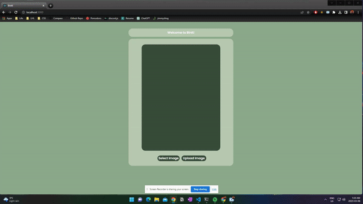

🏆 Winner of RootHacks 2023 "WiCS Women in Tech Award - Best project with at least one women-identifying or non-binary student on their team" 🏆

# BinIt!

BinIt is a web application that uses artificial intelligence (AI) to sort trash based on images. Users can take a photo of their trash using their device's camera and upload it onto our website. Then, BinIt will use computer vision and machine learning algorithms to identify the type of waste and suggest the correct bin to put it in.

## Features

BinIt currently supports sorting of recyclable materials like plastics, glass, and metals, as well as non-recyclable waste like food scraps or paper. The application also includes the following features:

- User-friendly interface for taking and uploading photos
- Real-time feedback on the type of trash and bin recommendations
- Backend Flask API to handle image recognition and bin recommendations
- TensorFlow and Keras-based AI model for accurate image recognition

## Demo



## Installation

To install and run BinIt, you'll need to follow these steps:

1. Clone the GitHub repository to your local machine using the following command:
   `git clone https://github.com/jimmyzhng/roothacks-project.git`

2. Install the front-end dependencies by running the following command in the `frontend` directory:

```console
pip install node
npm install
```

3. Install the back-end dependencies by running the following command in the `backend` directory:

```console
pip install flask
pip install numpy
pip install pytorch
pip install opencv-python
```

4. Start the front-end server by running the following command in the `frontend` directory:

```console
npm start
```

5. Start the back-end server by running the following command in the `backend` directory:

```console
source venv/bin/activate
python app.py
```

6. Open your web browser and navigate to `http://localhost:3000` to access the BinIt application.

## Usage

To use BinIt, follow these steps:

1. Open the BinIt application in your web browser.
2. Click the "Select Photo" button, and choose an image of your choice.
3. When clicked, a preview of your image will show up on our application.
4. When you click upload image, BinIt will automatically recognize the item and suggest the correct bin to put it in.
5. Repeat the process for additional items.
